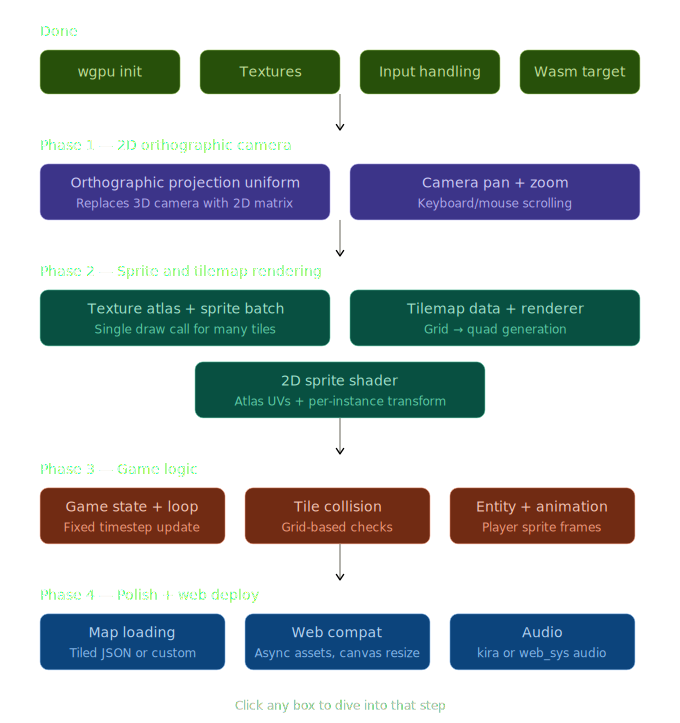

# 🌲 Forest Explorer — A Serious Game

> An educational browser game for children to learn about the forest ecosystem, built with a custom engine in Rust and WebGPU.

---

## 📖 About

**Forest Explorer** is a serious game developed as part of a university project. Players explore a living forest world, interact with plants, animals, and ecosystems — learning about nature through play.

The game runs entirely in the browser via WebAssembly, with no installation required.

### Learning Goals

- Understand the role of different plants and animals in a forest ecosystem
- Learn about food chains and interdependence in nature
- Discover the impact of human activity on forests
- Encourage environmental awareness in a fun, interactive way

---

## 🛠️ Tech Stack

| Layer | Technology |
|---|---|
| Language | [Rust](https://www.rust-lang.org/) |
| GPU Rendering | [wgpu](https://wgpu.rs/) (WebGPU / WebGL2) |
| Windowing | [winit](https://github.com/rust-windowing/winit) |
| Web Target | [WebAssembly](https://webassembly.org/) via [wasm-bindgen](https://github.com/rustwasm/wasm-bindgen) |
| Math | [cgmath](https://github.com/rustgfx/cgmath) |

The game is built on a **custom 2D engine** written from scratch — no third-party game framework. The engine handles:

- Orthographic camera with logical resolution scaling
- Sprite batching (single draw call per texture)
- Texture atlas animation system
- Fixed-timestep game loop
- Keyboard input tracking
- Native + WebAssembly dual targets

---

## 🗺️ Roadmap



---

## 🏗️ Project Structure

```
serious_games/
├── src/
│   ├── main.rs              # Entry point
│   ├── lib.rs               # App, event loop, wasm entry
│   ├── engine/
│   │   ├── engine.rs        # wgpu context: device, queue, surface
│   │   ├── renderer.rs      # Sprite batching, pipeline, draw calls
│   │   ├── camera.rs        # Orthographic camera + uniforms
│   │   ├── input.rs         # Key state tracking
│   │   ├── animation.rs     # Sprite sheet animation system
│   │   └── texture.rs       # Texture loading
│   ├── game/
│   │   ├── game.rs          # Game trait + MyGame implementation
│   │   ├── player.rs        # Player movement + animation
│   │   └── tile.rs          # Tile types and map
│   └── shader.wgsl          # Vertex + fragment shader
├── assets/
│   ├── player.png           # Player sprite atlas (4 cols × 8 rows)
│   └── grass.png            # Tile textures
├── docs/
│   └── milestones.svg       # Project milestone diagram
├── pkg/                     # wasm-pack output (git-ignored)
├── Cargo.toml
└── index.html               # Browser entry point
```

---

## 🚀 Running the Game

### In the browser

Requires [wasm-pack](https://rustwasm.github.io/wasm-pack/).

```bash
wasm-pack build --target web
# then serve the project root with any static file server, e.g.:
npx serve .
```

Open `http://localhost:3000` in a browser with WebGPU or WebGL2 support.

### Natively (for development)

```bash
cargo run
```

---

## 🎮 Controls

| Key | Action |
|---|---|
| `W` / `↑` | Move up |
| `S` / `↓` | Move down |
| `A` / `←` | Move left |
| `D` / `→` | Move right |
| `Shift` | Sprint |
| `Enter` / `Space` | Interact |
| `Escape` | Quit (native only) |

---

## 🖼️ Engine Architecture

The engine separates concerns into three clear layers:

```
┌─────────────────────────────────┐
│           Your Game             │  ← game.rs, player.rs, tile.rs
│   init()  update()  render()    │
└────────────────┬────────────────┘
                 │ Game trait
┌────────────────▼────────────────┐
│            Renderer             │  ← draw_sprite(), draw_sprite_frame()
│         Input  Camera           │
└────────────────┬────────────────┘
                 │
┌────────────────▼────────────────┐
│             Engine              │  ← wgpu device, queue, surface
│     (native + wasm targets)     │
└─────────────────────────────────┘
```

---

## 👥 Team

| Name | Role |
|---|---|
| _Your Name_ | Engine, Rendering |
| _Team Member_ | Game Design, Art |
| _Team Member_ | Level Design, Content |

---

## 📄 License

This project was developed for academic purposes at _[University Name]_.

---

> 🌱 *"The forest is not a resource to be managed, but a community to be respected."*
